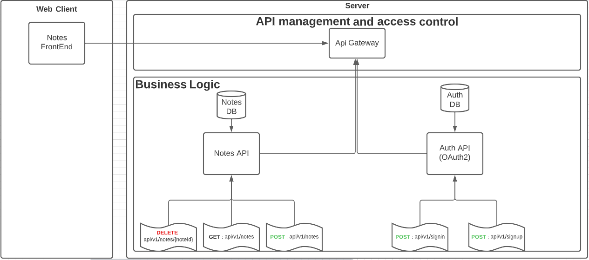
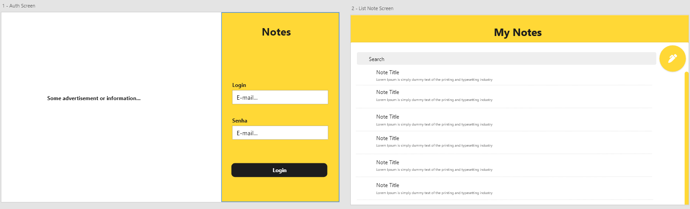
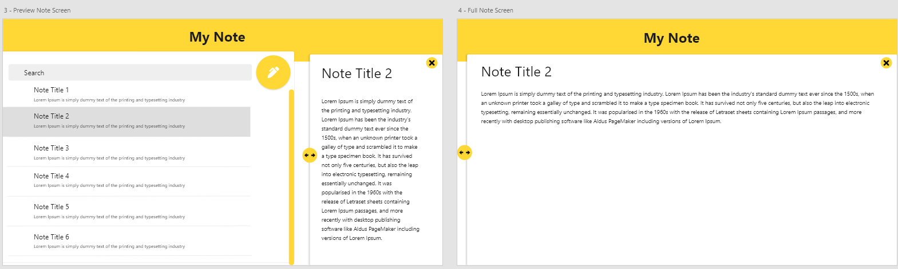
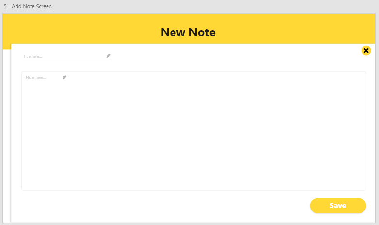
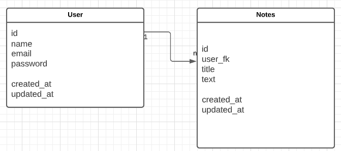

# Results achived...

## High Level Design, Restful API and Web Server 

The Client has to be authorized on API Gateway, after that it'll be possible to save, delete or get new notes. Also API Gateway will be responsible to manage which endpoints could be access with or without authorization.

If its needed an authorization, it'll be done by a TOKEN generated in AUTH API following the OAUTH protocol.

## Web App UI

## Data Model

