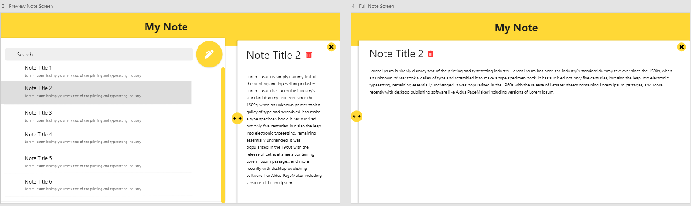

# Results achived...

## High Level Design, Restful API and Web Server 

In order to save, delete or get notes the Client has to call the Note API, passing first through the API Gateway where its access will be validated and might be authorized.So API Gateway has the responsibility
of managing which endpoints should be accessed with or without authorization.

If it's needed an authorization, it will be done by a TOKEN generated in AUTH API following the OAUTH protocol.

## Web App UI

## Data Model

